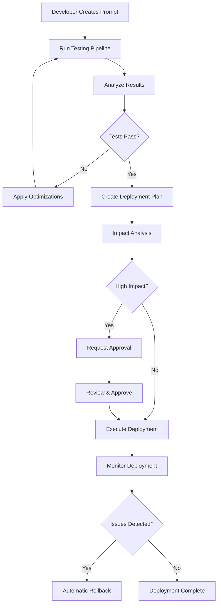
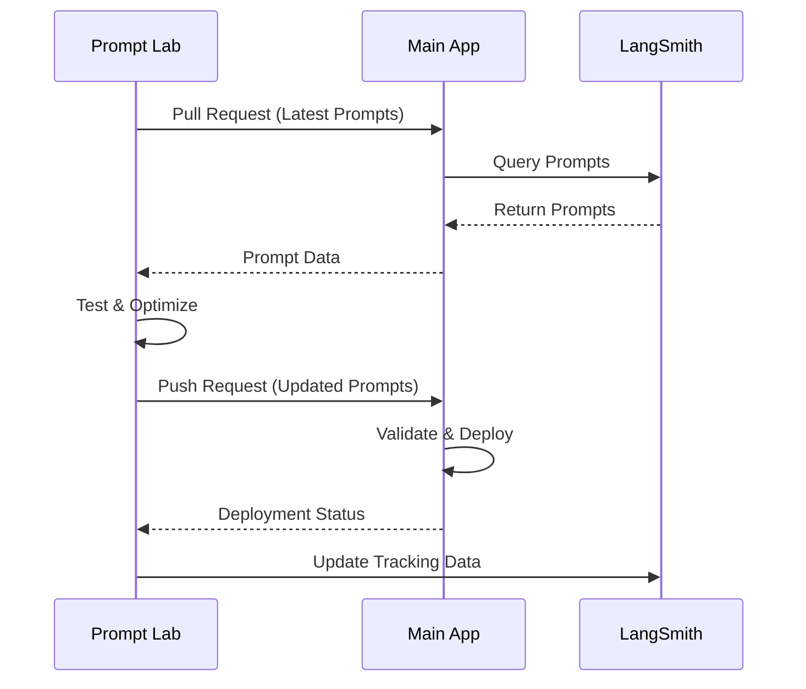
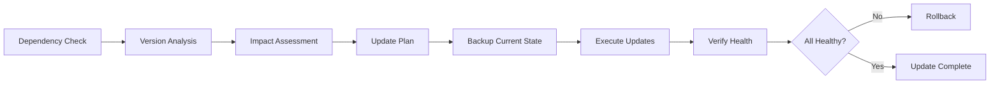

# Prompt Testing Lab Integration Architecture

## Overview

The Prompt Testing Lab is designed as a comprehensive system for testing, optimizing, and safely deploying prompts to production applications. This architecture enables seamless integration with main applications, providing bidirectional prompt synchronization, comprehensive testing pipelines, dependency management, and safe deployment strategies.

## Architecture Components

### 1. Integration Layer

The integration layer provides connectivity between the Prompt Testing Lab and main applications.

#### App Integration Service (`app-integration.service.ts`)
- **Purpose**: Manages connections to main applications (LangSmith, direct APIs, webhooks)
- **Key Features**:
  - Bidirectional prompt synchronization
  - Conflict detection and resolution
  - Deployment coordination
  - Integration health monitoring

#### Key Integration Types:
- **LangSmith**: Direct integration with LangChain's LangSmith platform
- **Direct API**: RESTful API integration with custom applications
- **Webhook**: Event-driven integration for real-time updates

### 2. Testing Pipeline System

Comprehensive testing framework for prompt validation and optimization.

#### Testing Pipeline Service (`testing-pipeline.service.ts`)
- **Purpose**: Orchestrates multi-stage testing workflows
- **Pipeline Stages**:
  - **Validation**: Structure and content validation
  - **Performance**: Latency and cost analysis
  - **Quality**: Output quality assessment
  - **Comparison**: A/B testing against baselines
  - **Optimization**: Automated improvement suggestions

#### Key Features:
- Multi-model testing support
- Parallel execution capabilities
- Automated optimization suggestions
- Configurable success criteria
- Real-time progress monitoring

### 3. Dependency Management System

Manages external dependencies and their updates.

#### Dependency Manager Service (`dependency-manager.service.ts`)
- **Purpose**: Tracks and manages external service dependencies
- **Supported Dependencies**:
  - LangSmith integrations
  - Model providers (OpenAI, Anthropic, Groq)
  - Webhook endpoints
  - Database connections
  - Monitoring services

#### Key Features:
- Health monitoring and alerting
- Version tracking and updates
- Dependency impact analysis
- Automated update planning
- Rollback capabilities

### 4. Safe Deployment Pipeline

Multi-strategy deployment system with comprehensive safety mechanisms.

#### Safe Deployment Service (`safe-deployment.service.ts`)
- **Purpose**: Ensures safe, monitored deployment of tested prompts
- **Deployment Strategies**:
  - **Blue-Green**: Full environment switching
  - **Canary**: Gradual traffic increase
  - **Rolling**: Sequential environment updates
  - **Immediate**: Direct deployment

#### Safety Features:
- Pre-deployment testing requirements
- Impact analysis before deployment
- Real-time monitoring and alerting
- Automatic rollback triggers
- Approval workflows for critical deployments

### 5. Impact Analysis System

Analyzes the potential impact of prompt changes.

#### Impact Analysis Service (`impact-analysis.service.ts`)
- **Purpose**: Quantifies changes between prompt versions
- **Analysis Components**:
  - Content diff analysis
  - Output comparison across test scenarios
  - Quality degradation detection
  - Performance impact assessment

## Data Models

### Core Database Schema

```prisma
// App Integration
model AppIntegration {
  id         String   @id @default(cuid())
  projectId  String
  name       String
  type       String   // 'langsmith', 'direct_api', 'webhook'
  baseUrl    String
  apiKeyHash String
  syncConfig Json
  isActive   Boolean  @default(true)
  lastSync   DateTime?
  createdBy  String
  createdAt  DateTime @default(now())
  updatedAt  DateTime @updatedAt
}

// Testing Pipeline
model TestPipeline {
  id          String   @id @default(cuid())
  projectId   String
  name        String
  description String?
  config      Json
  status      String   @default("DRAFT")
  createdBy   String
  createdAt   DateTime @default(now())
  updatedAt   DateTime @updatedAt
  stages      PipelineStage[]
}

model PipelineStage {
  id         String      @id @default(cuid())
  pipelineId String
  pipeline   TestPipeline @relation(fields: [pipelineId], references: [id])
  name       String
  type       String
  config     Json
  order      Int
  status     String      @default("PENDING")
  result     Json?
}

// Dependencies
model Dependency {
  id           String   @id @default(cuid())
  projectId    String
  name         String
  type         String
  provider     String
  config       Json
  status       String   @default("ACTIVE")
  version      String?
  healthScore  Float    @default(100)
  lastCheck    DateTime @default(now())
  createdBy    String
  createdAt    DateTime @default(now())
  updatedAt    DateTime @updatedAt
}

// Deployment
model DeploymentPlan {
  id        String   @id @default(cuid())
  projectId String
  promptId  String
  planData  Json
  status    String   @default("DRAFT")
  createdBy String
  createdAt DateTime @default(now())
  updatedAt DateTime @updatedAt
}

model DeploymentExecution {
  id           String    @id @default(cuid())
  planId       String
  status       String    @default("PENDING")
  currentStage Int       @default(0)
  startedAt    DateTime?
  completedAt  DateTime?
  executedBy   String
  metadata     Json?
  error        String?
  metrics      Json?
  createdAt    DateTime  @default(now())
  updatedAt    DateTime  @updatedAt
}
```

## API Contracts

### Integration Endpoints

#### Application Registration
```typescript
POST /api/integration/apps
{
  "name": "Main Application",
  "type": "langsmith",
  "baseUrl": "https://api.langchain.com",
  "apiKey": "lsv2_pt_...",
  "syncConfig": {
    "autoSync": true,
    "syncInterval": 60,
    "bidirectional": true,
    "promptFilters": {
      "tags": ["production"],
      "environments": ["staging", "production"]
    }
  }
}
```

#### Prompt Synchronization
```typescript
POST /api/integration/apps/:appId/sync
{
  "direction": "bidirectional",
  "environment": "production",
  "promptIds": ["prompt_123", "prompt_456"],
  "forceSync": false
}
```

#### Testing Pipeline Execution
```typescript
POST /api/integration/testing/pipelines/:pipelineId/execute
{
  "promptId": "prompt_123",
  "baselinePromptId": "prompt_122",
  "runAsync": true,
  "testDataset": ["scenario1", "scenario2"]
}
```

#### Safe Deployment
```typescript
POST /api/integration/deployment/plans
{
  "promptId": "prompt_123",
  "targetEnvironments": ["staging", "production"],
  "strategy": "canary",
  "requireApproval": true,
  "approvers": ["user_admin1", "user_admin2"],
  "strategyConfig": {
    "initialTrafficPercentage": 5,
    "trafficSteps": [10, 25, 50, 100],
    "monitoringDuration": 10
  }
}
```

## Workflow Examples

### 1. Complete Prompt Development Lifecycle



### 2. Bidirectional Sync Workflow



### 3. Dependency Update Workflow



## Security Considerations

### 1. API Key Management
- Keys are hashed before storage
- Support for key rotation
- Secure transmission (HTTPS only)
- Rate limiting per key

### 2. Access Control
- Role-based permissions (Owner, Admin, Member, Viewer)
- Project-level isolation
- Deployment approval workflows
- Audit logging for all actions

### 3. Data Protection
- Sensitive prompt content encryption
- Secure backup and recovery
- GDPR compliance measures
- Data retention policies

## Monitoring and Observability

### 1. System Metrics
- Integration health scores
- Sync success rates
- Deployment success rates
- Performance metrics

### 2. Alerting
- Dependency health degradation
- Deployment failures
- Sync conflicts
- Performance threshold breaches

### 3. Logging
- Structured logging for all operations
- Correlation IDs for request tracking
- Security event logging
- Performance metrics collection

## Deployment Architecture

### Development Environment
```yaml
services:
  api:
    image: prompt-lab-api:dev
    environment:
      - NODE_ENV=development
      - DATABASE_URL=postgresql://...
      - REDIS_URL=redis://...
  
  web:
    image: prompt-lab-web:dev
    depends_on:
      - api
  
  postgres:
    image: postgres:15
    
  redis:
    image: redis:7
```

### Production Environment
```yaml
# Kubernetes Deployment
apiVersion: apps/v1
kind: Deployment
metadata:
  name: prompt-lab-api
spec:
  replicas: 3
  selector:
    matchLabels:
      app: prompt-lab-api
  template:
    spec:
      containers:
      - name: api
        image: prompt-lab-api:latest
        env:
        - name: DATABASE_URL
          valueFrom:
            secretKeyRef:
              name: database-secret
              key: url
        resources:
          requests:
            memory: "512Mi"
            cpu: "250m"
          limits:
            memory: "1Gi"
            cpu: "500m"
```

## Performance Optimization

### 1. Caching Strategy
- Redis for session and temporary data
- Database query optimization
- API response caching
- CDN for static assets

### 2. Scaling Considerations
- Horizontal pod autoscaling
- Database connection pooling
- Queue-based background processing
- Load balancing

### 3. Resource Management
- Memory-efficient prompt processing
- Streaming for large responses
- Batch processing for sync operations
- Graceful degradation under load

## Future Enhancements

### 1. Advanced Features
- Multi-modal prompt support
- Advanced evaluation metrics
- ML-based optimization suggestions
- Custom plugin system

### 2. Integration Expansions
- Additional LLM providers
- Enterprise SSO integration
- Advanced workflow automation
- Real-time collaboration features

### 3. Operational Improvements
- Advanced monitoring dashboards
- Predictive health monitoring
- Automated capacity planning
- Enhanced security features

## Implementation Guide

### Phase 1: Core Integration (Weeks 1-4)
1. Set up basic app integration service
2. Implement prompt synchronization
3. Create basic testing pipeline
4. Add dependency management

### Phase 2: Advanced Testing (Weeks 5-8)
1. Implement multi-stage testing pipelines
2. Add optimization suggestions
3. Create impact analysis system
4. Build monitoring capabilities

### Phase 3: Safe Deployment (Weeks 9-12)
1. Implement deployment strategies
2. Add approval workflows
3. Create rollback mechanisms
4. Build comprehensive monitoring

### Phase 4: Production Readiness (Weeks 13-16)
1. Security hardening
2. Performance optimization
3. Documentation completion
4. User training and onboarding

This architecture provides a robust, scalable foundation for prompt engineering workflows that can adapt to various organizational needs while maintaining high standards for testing, deployment safety, and operational reliability.