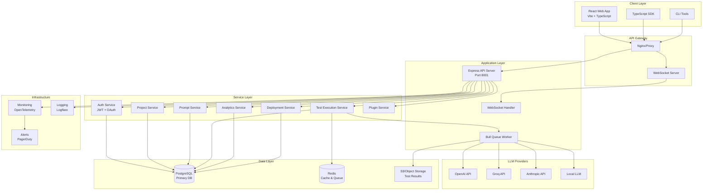
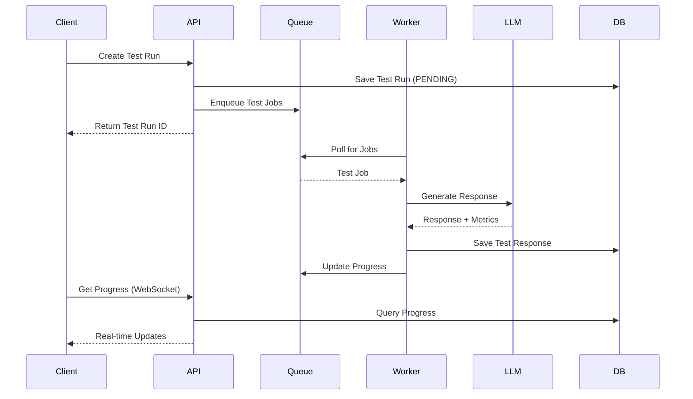
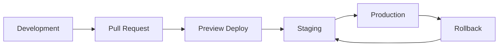

# Prompt Testing Lab - System Architecture

## Overview

The Prompt Testing Lab is a comprehensive A/B testing platform for LLM prompts, built as a modular microservice architecture. It enables teams to test, compare, and optimize prompts across multiple LLM providers with real-time analytics and deployment management.

## System Architecture Diagram



## Component Architecture

### 1. **Frontend Layer**

#### Web Application (React + Vite)
```typescript
packages/web/
├── src/
│   ├── components/        # Atomic design components
│   │   ├── atoms/        # Basic UI elements
│   │   ├── molecules/    # Composite components
│   │   ├── organisms/    # Complex features
│   │   └── templates/    # Page layouts
│   ├── pages/            # Route components
│   ├── hooks/            # Custom React hooks
│   ├── lib/              # Business logic
│   │   ├── api/         # API client functions
│   │   └── utils/       # Helper functions
│   └── types/            # TypeScript definitions
```

**Key Technologies:**
- React 18 with TypeScript
- Vite for fast builds
- TanStack Query for data fetching
- Tailwind CSS + Radix UI
- Monaco Editor for code editing
- WebSocket for real-time updates

### 2. **API Layer**

#### Express API Server
```typescript
packages/api/
├── src/
│   ├── routes/           # API endpoints
│   ├── services/         # Business logic
│   ├── middleware/       # Express middleware
│   ├── interfaces/       # TypeScript interfaces
│   ├── utils/           # Helper functions
│   └── generated/       # Prisma client
```

**Core Services:**
- **AuthService**: JWT token management, OAuth integration
- **ProjectService**: Multi-tenant project management
- **PromptService**: Prompt versioning and management
- **TestExecutionService**: A/B test orchestration
- **QueueService**: Background job processing
- **WebSocketService**: Real-time event broadcasting
- **PluginService**: Extensible evaluation system

### 3. **Data Architecture**

#### Database Schema (PostgreSQL)

```sql
-- Core Entities
User
├── id: UUID
├── email: String
├── name: String
├── role: Enum[ADMIN, USER, VIEWER]
└── createdAt: DateTime

Project
├── id: UUID
├── name: String
├── description: String?
├── ownerId: UUID (FK → User)
├── settings: JSON
└── createdAt: DateTime

Prompt
├── id: UUID
├── projectId: UUID (FK → Project)
├── name: String
├── template: String
├── version: Int
├── parentPromptId: UUID? (FK → Prompt)
├── modelConfig: JSON
└── createdAt: DateTime

TestRun
├── id: UUID
├── projectId: UUID (FK → Project)
├── status: Enum[PENDING, RUNNING, COMPLETED, FAILED]
├── config: JSON
├── startedAt: DateTime?
└── completedAt: DateTime?

TestResponse
├── id: UUID
├── testRunId: UUID (FK → TestRun)
├── promptId: UUID (FK → Prompt)
├── modelProvider: String
├── modelName: String
├── output: String
├── tokenUsage: JSON
├── latencyMs: Int
├── cost: Decimal
└── createdAt: DateTime
```

#### Cache Strategy (Redis)

```javascript
// Cache Keys Structure
project:{projectId}              // Project details (TTL: 1h)
prompt:{promptId}               // Prompt details (TTL: 1h)
test:progress:{testRunId}       // Test progress (TTL: 5m)
user:ratelimit:{userId}         // Rate limiting (TTL: 15m)
deployment:active:{projectId}   // Active deployments (TTL: 5m)
```

### 4. **LLM Integration Architecture**

#### Provider Abstraction Layer

```typescript
interface LLMProvider {
  name: string;
  generateResponse(config: ModelConfig): Promise<LLMResponse>;
  calculateCost(usage: TokenUsage): number;
  validateConfig(config: ModelConfig): boolean;
}

class OpenAIProvider implements LLMProvider {
  async generateResponse(config) {
    // OpenAI-specific implementation
  }
}

class GroqProvider implements LLMProvider {
  async generateResponse(config) {
    // Groq-specific implementation
  }
}

// Factory pattern for provider selection
class LLMProviderFactory {
  static getProvider(providerName: string): LLMProvider {
    switch(providerName) {
      case 'openai': return new OpenAIProvider();
      case 'groq': return new GroqProvider();
      case 'anthropic': return new AnthropicProvider();
      default: throw new Error(`Unknown provider: ${providerName}`);
    }
  }
}
```

### 5. **Queue Architecture**

#### Job Processing Flow



### 6. **Deployment Architecture**

#### Multi-Environment Setup

```yaml
Environments:
  Development:
    - Local SQLite DB
    - Mock LLM responses
    - Hot reload enabled
    
  Staging:
    - PostgreSQL (Supabase)
    - Real LLM providers (rate limited)
    - Preview deployments
    
  Production:
    - PostgreSQL cluster
    - Redis cluster
    - Auto-scaling workers
    - CDN for static assets
```

#### Deployment Flow



### 7. **Security Architecture**

#### Authentication & Authorization

```typescript
// JWT Token Structure
{
  sub: string;      // User ID
  email: string;
  role: string;
  permissions: string[];
  projects: string[];  // Accessible project IDs
  iat: number;
  exp: number;
}

// Middleware Stack
app.use(helmet());              // Security headers
app.use(cors(corsOptions));     // CORS policy
app.use(rateLimiter);          // Rate limiting
app.use(authMiddleware);       // JWT validation
app.use(rbacMiddleware);       // Role-based access
app.use(auditLogger);          // Audit trail
```

#### Data Security

- **Encryption at Rest**: PostgreSQL with TDE
- **Encryption in Transit**: TLS 1.3
- **API Key Management**: Encrypted storage with rotation
- **PII Handling**: Anonymization for analytics
- **Audit Logging**: All data modifications tracked

### 8. **Monitoring & Observability**

#### Metrics Collection

```typescript
// OpenTelemetry Setup
const meter = opentelemetry.metrics.getMeter('prompt-lab');

// Custom Metrics
const testRunCounter = meter.createCounter('test_runs_total');
const testLatencyHistogram = meter.createHistogram('test_latency_ms');
const llmCostCounter = meter.createCounter('llm_cost_usd');
const errorRate = meter.createCounter('api_errors_total');

// Distributed Tracing
const tracer = opentelemetry.trace.getTracer('prompt-lab');
```

#### Health Checks

```typescript
// Health Check Endpoints
GET /health           // Basic liveness
GET /health/ready     // Readiness check
GET /health/detailed  // Comprehensive status

// Example Response
{
  "status": "healthy",
  "timestamp": "2024-01-20T12:00:00Z",
  "services": {
    "database": "connected",
    "redis": "connected",
    "queue": "active",
    "llm_providers": {
      "openai": "available",
      "groq": "available",
      "anthropic": "rate_limited"
    }
  }
}
```

### 9. **Scalability Patterns**

#### Horizontal Scaling

```yaml
# Kubernetes Deployment
apiVersion: apps/v1
kind: Deployment
metadata:
  name: prompt-lab-api
spec:
  replicas: 3
  strategy:
    type: RollingUpdate
    rollingUpdate:
      maxSurge: 1
      maxUnavailable: 0
  template:
    spec:
      containers:
      - name: api
        image: prompt-lab/api:latest
        resources:
          requests:
            cpu: 500m
            memory: 512Mi
          limits:
            cpu: 2000m
            memory: 2Gi
```

#### Caching Strategy

1. **CDN Layer**: Static assets, public endpoints
2. **Application Cache**: Redis for hot data
3. **Database Cache**: Query result caching
4. **LLM Response Cache**: Deterministic prompt results

### 10. **Plugin Architecture**

#### Extensibility Framework

```typescript
// Plugin Interface
interface EvaluatorPlugin {
  id: string;
  name: string;
  version: string;
  
  // Lifecycle hooks
  onInstall(): Promise<void>;
  onUninstall(): Promise<void>;
  
  // Evaluation method
  evaluate(context: EvaluationContext): Promise<EvaluationResult>;
}

// Plugin Registry
class PluginRegistry {
  private plugins: Map<string, EvaluatorPlugin> = new Map();
  
  register(plugin: EvaluatorPlugin): void {
    this.plugins.set(plugin.id, plugin);
  }
  
  async runEvaluations(context: EvaluationContext): Promise<Results> {
    const results = await Promise.all(
      Array.from(this.plugins.values()).map(plugin => 
        plugin.evaluate(context)
      )
    );
    return aggregateResults(results);
  }
}
```

## Performance Optimization

### 1. **Database Optimization**
- Connection pooling (min: 2, max: 10)
- Indexed columns for common queries
- Partitioned tables for test_responses
- Materialized views for analytics

### 2. **API Optimization**
- Response compression (gzip/brotli)
- Request batching for bulk operations
- Pagination with cursor-based navigation
- Partial responses with field selection

### 3. **LLM Cost Optimization**
- Request deduplication
- Response caching for deterministic prompts
- Batch processing for multiple inputs
- Automatic model downgrade on budget limits

## Disaster Recovery

### Backup Strategy
- **Database**: Daily automated backups, 30-day retention
- **Object Storage**: Cross-region replication
- **Configuration**: Version controlled in Git

### Recovery Procedures
1. **RTO**: 4 hours
2. **RPO**: 1 hour
3. **Failover**: Automated with health checks
4. **Rollback**: One-click deployment reversal

## Future Architecture Considerations

### Phase 2 Enhancements
- GraphQL API layer
- Kubernetes orchestration
- Multi-region deployment
- Advanced ML evaluation models

### Phase 3 Evolution
- Federated learning for prompt optimization
- Real-time collaboration features
- Advanced workflow automation
- Enterprise SSO integration

## Architecture Decision Records (ADRs)

### ADR-001: Monorepo Structure
**Decision**: Use pnpm workspace monorepo
**Rationale**: Shared types, unified tooling, atomic commits

### ADR-002: PostgreSQL over NoSQL
**Decision**: PostgreSQL as primary database
**Rationale**: ACID compliance, complex queries, proven scale

### ADR-003: Express over Fastify
**Decision**: Express.js for API server
**Rationale**: Ecosystem maturity, team familiarity, middleware availability

### ADR-004: JWT over Sessions
**Decision**: Stateless JWT authentication
**Rationale**: Horizontal scaling, microservice compatibility, mobile SDK support