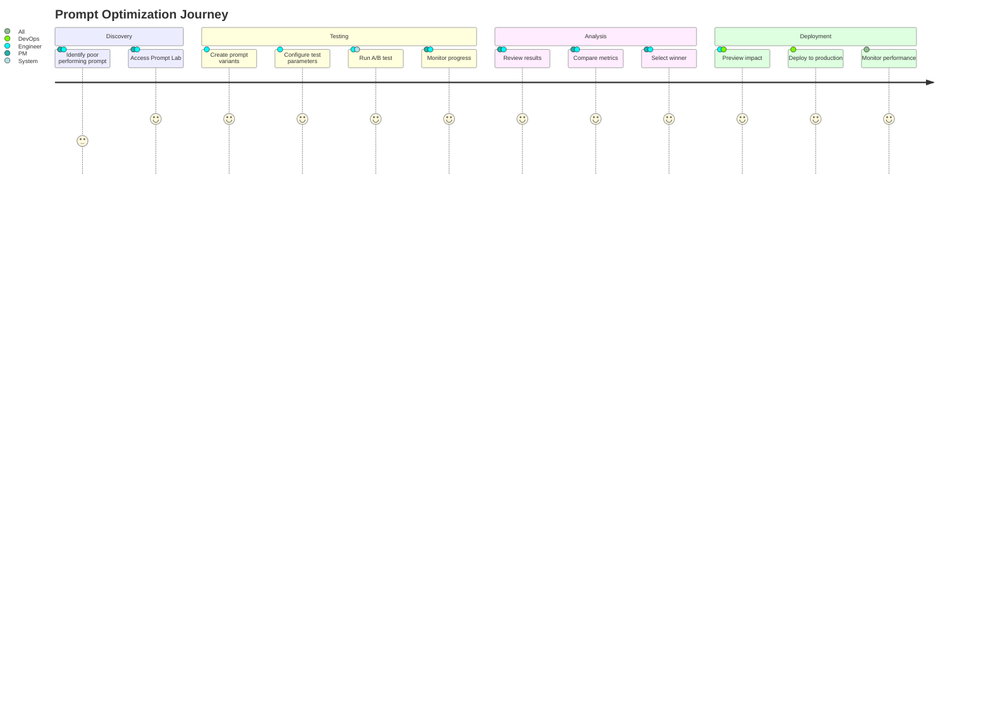
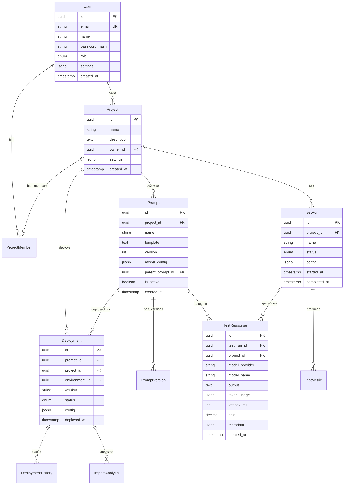

# Prompt Testing Lab - Product Requirements Document (PRD)

## Executive Summary

The Prompt Testing Lab is an enterprise-grade A/B testing platform for Large Language Model (LLM) prompts. It enables organizations to systematically test, compare, and optimize their AI prompts across multiple providers, reducing costs while improving output quality and consistency.

### Key Value Propositions
- **Reduce LLM costs by 40-60%** through systematic prompt optimization
- **Improve response quality** with data-driven A/B testing
- **Deploy with confidence** using impact analysis and rollback capabilities
- **Multi-provider support** prevents vendor lock-in
- **Enterprise-ready** with SOC2-compliant security and audit trails

## Product Vision

To become the industry standard for LLM prompt optimization, enabling every organization to maximize the value of their AI investments through scientific testing and continuous improvement.

## Target Users

### Primary Personas

1. **AI/ML Engineers**
   - Need: Optimize prompt performance across models
   - Pain: Manual testing is time-consuming and inconsistent
   - Goal: Achieve best quality/cost ratio

2. **Product Managers**
   - Need: Ensure AI features meet user expectations
   - Pain: No visibility into prompt performance
   - Goal: Data-driven decisions on AI features

3. **DevOps Teams**
   - Need: Safe deployment of prompt changes
   - Pain: No rollback mechanism for bad prompts
   - Goal: Zero-downtime prompt updates

4. **Cost Controllers**
   - Need: Manage and reduce AI spending
   - Pain: Unpredictable LLM costs
   - Goal: Predictable, optimized AI budget

## Core Features

### 1. **Prompt Management**
- Version control for prompts
- Template variables and dynamic content
- Tagging and categorization
- Import/export capabilities
- Collaborative editing with approval workflows

### 2. **A/B/n Testing Engine**
- Side-by-side prompt comparison
- Multi-model testing (OpenAI, Anthropic, Groq, etc.)
- Statistical significance calculation
- Custom evaluation criteria
- Batch testing with multiple inputs

### 3. **Real-time Analytics**
- Performance metrics dashboard
- Cost tracking and projections
- Token usage analysis
- Response time monitoring
- Error rate tracking

### 4. **Deployment Management**
- One-click deployment to production
- Staged rollouts with traffic splitting
- Automatic rollback on performance degradation
- Impact analysis before deployment
- Multi-environment support

### 5. **Cost Optimization**
- Automatic model selection based on requirements
- Budget alerts and limits
- Cost/performance trade-off analysis
- Usage forecasting
- Department-level cost allocation

### 6. **Integration Ecosystem**
- REST API and SDKs (TypeScript, Python, Go)
- Webhook notifications
- CI/CD pipeline integration
- Monitoring tool integration (Datadog, New Relic)
- SSO and SCIM support

## User Journey

### Typical Workflow



## Technical Specifications

### System Requirements

#### Performance Targets
- API Response Time: p95 < 200ms
- Test Execution: < 30s for 100 inputs
- Dashboard Load: < 2s
- WebSocket Latency: < 100ms
- Availability: 99.9% uptime SLA

#### Scalability
- Support 10,000 concurrent users
- Process 1M+ API requests/day
- Store 1B+ test results
- Handle 100 concurrent test runs

### API Specifications

#### RESTful API Design

```yaml
openapi: 3.0.0
info:
  title: Prompt Testing Lab API
  version: 1.0.0
  description: Enterprise A/B testing for LLM prompts

servers:
  - url: https://api.promptlab.ai/v1
    description: Production server
  - url: https://staging-api.promptlab.ai/v1
    description: Staging server

paths:
  /auth/login:
    post:
      summary: Authenticate user
      requestBody:
        required: true
        content:
          application/json:
            schema:
              type: object
              properties:
                email:
                  type: string
                  format: email
                password:
                  type: string
                  format: password
      responses:
        200:
          description: Successful authentication
          content:
            application/json:
              schema:
                type: object
                properties:
                  token:
                    type: string
                  refreshToken:
                    type: string
                  user:
                    $ref: '#/components/schemas/User'

  /projects:
    get:
      summary: List user's projects
      security:
        - bearerAuth: []
      parameters:
        - name: page
          in: query
          schema:
            type: integer
            default: 1
        - name: limit
          in: query
          schema:
            type: integer
            default: 20
      responses:
        200:
          description: Project list
          content:
            application/json:
              schema:
                type: object
                properties:
                  data:
                    type: array
                    items:
                      $ref: '#/components/schemas/Project'
                  pagination:
                    $ref: '#/components/schemas/Pagination'

    post:
      summary: Create new project
      security:
        - bearerAuth: []
      requestBody:
        required: true
        content:
          application/json:
            schema:
              $ref: '#/components/schemas/ProjectCreate'
      responses:
        201:
          description: Project created
          content:
            application/json:
              schema:
                $ref: '#/components/schemas/Project'

  /projects/{projectId}/prompts:
    get:
      summary: List project prompts
      security:
        - bearerAuth: []
      parameters:
        - name: projectId
          in: path
          required: true
          schema:
            type: string
            format: uuid
      responses:
        200:
          description: Prompt list
          content:
            application/json:
              schema:
                type: array
                items:
                  $ref: '#/components/schemas/Prompt'

    post:
      summary: Create new prompt
      security:
        - bearerAuth: []
      parameters:
        - name: projectId
          in: path
          required: true
          schema:
            type: string
      requestBody:
        required: true
        content:
          application/json:
            schema:
              $ref: '#/components/schemas/PromptCreate'
      responses:
        201:
          description: Prompt created

  /projects/{projectId}/test-runs:
    post:
      summary: Create and start test run
      security:
        - bearerAuth: []
      parameters:
        - name: projectId
          in: path
          required: true
          schema:
            type: string
      requestBody:
        required: true
        content:
          application/json:
            schema:
              $ref: '#/components/schemas/TestRunCreate'
      responses:
        201:
          description: Test run created
          content:
            application/json:
              schema:
                $ref: '#/components/schemas/TestRun'

  /test-runs/{testRunId}:
    get:
      summary: Get test run details
      security:
        - bearerAuth: []
      parameters:
        - name: testRunId
          in: path
          required: true
          schema:
            type: string
      responses:
        200:
          description: Test run details
          content:
            application/json:
              schema:
                $ref: '#/components/schemas/TestRunDetails'

  /test-runs/{testRunId}/comparison:
    get:
      summary: Get model comparison results
      security:
        - bearerAuth: []
      parameters:
        - name: testRunId
          in: path
          required: true
          schema:
            type: string
      responses:
        200:
          description: Comparison results
          content:
            application/json:
              schema:
                $ref: '#/components/schemas/ComparisonResults'

  /deployments:
    post:
      summary: Create deployment
      security:
        - bearerAuth: []
      requestBody:
        required: true
        content:
          application/json:
            schema:
              $ref: '#/components/schemas/DeploymentCreate'
      responses:
        201:
          description: Deployment created

  /deployments/{deploymentId}/rollback:
    post:
      summary: Rollback deployment
      security:
        - bearerAuth: []
      parameters:
        - name: deploymentId
          in: path
          required: true
          schema:
            type: string
      responses:
        200:
          description: Rollback initiated

components:
  securitySchemes:
    bearerAuth:
      type: http
      scheme: bearer
      bearerFormat: JWT

  schemas:
    User:
      type: object
      properties:
        id:
          type: string
          format: uuid
        email:
          type: string
          format: email
        name:
          type: string
        role:
          type: string
          enum: [admin, user, viewer]

    Project:
      type: object
      properties:
        id:
          type: string
          format: uuid
        name:
          type: string
        description:
          type: string
        settings:
          type: object
        createdAt:
          type: string
          format: date-time

    Prompt:
      type: object
      properties:
        id:
          type: string
          format: uuid
        name:
          type: string
        template:
          type: string
        version:
          type: integer
        modelConfig:
          $ref: '#/components/schemas/ModelConfig'

    ModelConfig:
      type: object
      properties:
        provider:
          type: string
          enum: [openai, anthropic, groq, local]
        modelName:
          type: string
        temperature:
          type: number
          minimum: 0
          maximum: 2
        maxTokens:
          type: integer
          minimum: 1

    TestRun:
      type: object
      properties:
        id:
          type: string
          format: uuid
        status:
          type: string
          enum: [pending, running, completed, failed, cancelled]
        progress:
          type: object
          properties:
            completed:
              type: integer
            total:
              type: integer

    TestRunCreate:
      type: object
      required:
        - promptIds
        - testInputs
      properties:
        name:
          type: string
        promptIds:
          type: array
          items:
            type: string
        testInputs:
          type: array
          items:
            type: string
        evaluationCriteria:
          type: array
          items:
            type: string

    ComparisonResults:
      type: object
      properties:
        models:
          type: array
          items:
            type: object
            properties:
              model:
                type: string
              metrics:
                type: object
                properties:
                  avgLatency:
                    type: number
                  totalCost:
                    type: number
                  errorRate:
                    type: number
                  scores:
                    type: object
```

### WebSocket Events

```typescript
// WebSocket Event Types
interface WebSocketEvents {
  // Client -> Server
  'authenticate': { token: string };
  'subscribe': { channels: string[] };
  'unsubscribe': { channels: string[] };
  
  // Server -> Client
  'authenticated': { user: User };
  'test_progress': { 
    testRunId: string;
    progress: number;
    currentPrompt: string;
  };
  'test_completed': {
    testRunId: string;
    results: TestResults;
  };
  'deployment_update': {
    deploymentId: string;
    status: DeploymentStatus;
  };
  'notification': {
    type: 'info' | 'warning' | 'error';
    message: string;
  };
}
```

### SDK Examples

#### TypeScript SDK

```typescript
import { PromptLabSDK } from '@promptlab/sdk';

const sdk = new PromptLabSDK({
  apiKey: process.env.PROMPTLAB_API_KEY,
  baseUrl: 'https://api.promptlab.ai/v1'
});

// Create and run A/B test
const testRun = await sdk.createTestRun({
  projectId: 'proj_123',
  name: 'Customer Support Prompt Test',
  promptIds: ['prompt_abc', 'prompt_def'],
  testInputs: [
    'How do I reset my password?',
    'I need a refund for my order',
    'Technical support needed'
  ],
  evaluationCriteria: ['relevance', 'helpfulness', 'tone'],
  modelConfigs: {
    'prompt_abc': {
      provider: 'openai',
      modelName: 'gpt-4',
      temperature: 0.3
    },
    'prompt_def': {
      provider: 'anthropic',
      modelName: 'claude-3-opus',
      temperature: 0.5
    }
  }
});

// Subscribe to real-time updates
sdk.on('test_progress', (event) => {
  console.log(`Progress: ${event.progress}%`);
});

// Get results
const results = await sdk.waitForCompletion(testRun.id);
console.log('Winner:', results.winner);
console.log('Improvement:', results.improvement);
```

#### Python SDK

```python
from promptlab import PromptLabClient

client = PromptLabClient(
    api_key=os.environ['PROMPTLAB_API_KEY']
)

# Create test run
test_run = client.create_test_run(
    project_id='proj_123',
    name='Python SDK Test',
    prompt_ids=['prompt_abc', 'prompt_def'],
    test_inputs=[
        'Summarize this article',
        'Translate to Spanish',
        'Extract key points'
    ]
)

# Monitor progress
for progress in client.monitor_progress(test_run.id):
    print(f"Progress: {progress.percentage}%")

# Get results
results = client.get_results(test_run.id)
print(f"Best performing prompt: {results.winner}")
```

## Data Model

### Entity Relationship Diagram



## Security & Compliance

### Security Requirements

1. **Authentication & Authorization**
   - JWT-based authentication with refresh tokens
   - Role-based access control (RBAC)
   - API key management with rotation
   - SSO integration (SAML 2.0, OAuth 2.0)

2. **Data Security**
   - Encryption at rest (AES-256)
   - Encryption in transit (TLS 1.3)
   - PII anonymization options
   - Data retention policies

3. **Compliance**
   - SOC 2 Type II certified
   - GDPR compliant
   - CCPA compliant
   - HIPAA ready (optional)

4. **Audit & Monitoring**
   - Comprehensive audit logs
   - Real-time security monitoring
   - Anomaly detection
   - DDoS protection

### Privacy Controls

- User consent management
- Data export capabilities
- Right to deletion (RTBF)
- Data residency options

## Success Metrics

### Business KPIs

1. **Adoption Metrics**
   - Monthly Active Users (MAU)
   - Projects created per month
   - Test runs per user
   - API calls per day

2. **Value Metrics**
   - Average cost reduction per customer
   - Response quality improvement
   - Time saved per optimization
   - ROI on prompt testing

3. **Technical Metrics**
   - API uptime (target: 99.9%)
   - Response time (p95 < 200ms)
   - Test execution speed
   - Error rate (< 0.1%)

4. **Customer Success**
   - NPS score (target: > 40)
   - Customer retention rate
   - Feature adoption rate
   - Support ticket volume

## Roadmap

### Phase 1: Foundation (Q1 2024)
- ✅ Core A/B testing engine
- ✅ Multi-model support
- ✅ Basic analytics
- ✅ REST API
- ✅ TypeScript SDK

### Phase 2: Enterprise (Q2 2024)
- ⏳ SSO integration
- ⏳ Advanced RBAC
- ⏳ Audit logging
- ⏳ Python SDK
- ⏳ Deployment management

### Phase 3: Intelligence (Q3 2024)
- 📋 AI-powered prompt suggestions
- 📋 Automatic optimization
- 📋 Anomaly detection
- 📋 Cost prediction
- 📋 Advanced analytics

### Phase 4: Platform (Q4 2024)
- 📋 Marketplace for prompts
- 📋 Community features
- 📋 Workflow automation
- 📋 Custom plugins
- 📋 White-label options

## Competitive Analysis

### Direct Competitors

1. **PromptPerfect**
   - Strengths: Simple UI, free tier
   - Weaknesses: Limited providers, no deployment
   - Our advantage: Enterprise features, multi-provider

2. **LangSmith**
   - Strengths: LangChain integration, tracing
   - Weaknesses: Complex setup, expensive
   - Our advantage: Easier onboarding, better pricing

3. **Humanloop**
   - Strengths: Good analytics, versioning
   - Weaknesses: Limited to OpenAI
   - Our advantage: Multi-provider, better deployment

### Indirect Competitors

- Internal tools (build vs buy)
- General A/B testing platforms
- LLM provider consoles

## Pricing Strategy

### Pricing Tiers

1. **Free Tier**
   - 1,000 test runs/month
   - 2 projects
   - Community support
   - Basic analytics

2. **Professional ($99/month)**
   - 10,000 test runs/month
   - Unlimited projects
   - Email support
   - Advanced analytics
   - API access

3. **Team ($499/month)**
   - 50,000 test runs/month
   - Team collaboration
   - Priority support
   - SSO integration
   - Audit logs

4. **Enterprise (Custom)**
   - Unlimited test runs
   - Dedicated support
   - Custom integrations
   - SLA guarantees
   - On-premise option

### Revenue Model

- Subscription-based SaaS
- Usage-based pricing for overages
- Professional services for enterprise
- Training and certification programs

## Risk Analysis

### Technical Risks

1. **LLM Provider Outages**
   - Mitigation: Multi-provider failover
   - Impact: Medium
   - Probability: Low

2. **Data Security Breach**
   - Mitigation: Security audits, encryption
   - Impact: High
   - Probability: Low

3. **Scaling Challenges**
   - Mitigation: Cloud-native architecture
   - Impact: Medium
   - Probability: Medium

### Business Risks

1. **Competitor Features**
   - Mitigation: Rapid innovation cycle
   - Impact: Medium
   - Probability: High

2. **LLM Provider Changes**
   - Mitigation: Provider abstraction layer
   - Impact: Medium
   - Probability: Medium

3. **Customer Churn**
   - Mitigation: Strong customer success
   - Impact: High
   - Probability: Medium

## Launch Strategy

### GTM Plan

1. **Beta Launch (Month 1-2)**
   - 50 design partners
   - Weekly feedback sessions
   - Rapid iteration

2. **Public Launch (Month 3)**
   - Product Hunt launch
   - Content marketing campaign
   - Webinar series

3. **Enterprise Push (Month 4-6)**
   - Sales team hiring
   - Partner integrations
   - Case studies

### Marketing Channels

- Content marketing (blog, guides)
- Developer communities
- Conference speaking
- Partner co-marketing
- Paid acquisition (carefully tested)

## Team Requirements

### Core Team

1. **Engineering (6-8 people)**
   - Backend engineers (3)
   - Frontend engineers (2)
   - DevOps engineer (1)
   - QA engineer (1)
   - Engineering manager (1)

2. **Product (2-3 people)**
   - Product manager (1)
   - Product designer (1)
   - Technical writer (1)

3. **Go-to-Market (3-4 people)**
   - Marketing lead (1)
   - Sales engineers (2)
   - Customer success (1)

### Advisory Needs

- LLM/AI expert
- Enterprise sales advisor
- Security/compliance expert
- SaaS metrics expert

## Success Criteria

### Year 1 Goals

- 1,000 active customers
- $1M ARR
- 99.9% uptime
- NPS > 40
- 3 major LLM providers integrated

### Exit Criteria

The product will be considered successful and ready for next phase when:
1. Achieving $5M ARR
2. 5,000+ active customers
3. Proven 40%+ cost reduction for customers
4. Market leader in prompt testing category
5. Strategic acquisition interest

## Appendices

### A. Glossary
- **LLM**: Large Language Model
- **Prompt**: Input text sent to an LLM
- **Token**: Unit of text processing in LLMs
- **Model Config**: Settings for LLM behavior
- **Test Run**: Single execution of A/B test

### B. References
- OpenAI API Documentation
- Anthropic Claude Documentation
- LangChain Documentation
- A/B Testing Best Practices

### C. User Research
- 50 customer interviews conducted
- Key pain points identified
- Feature prioritization matrix
- Competitive analysis details

### D. Technical Specifications
- Detailed API documentation
- Database schema
- Security architecture
- Performance benchmarks