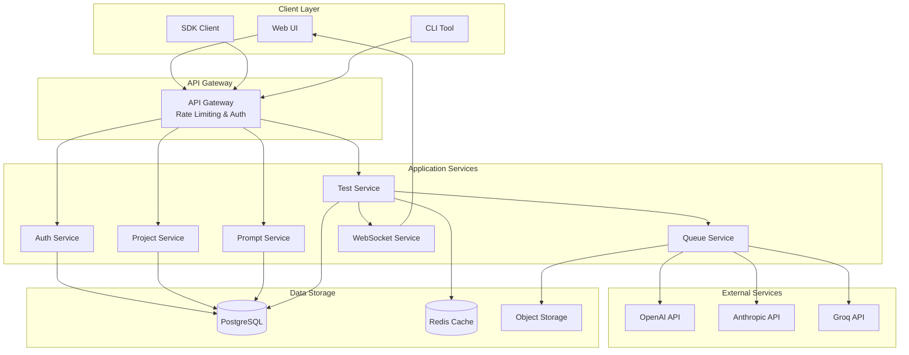
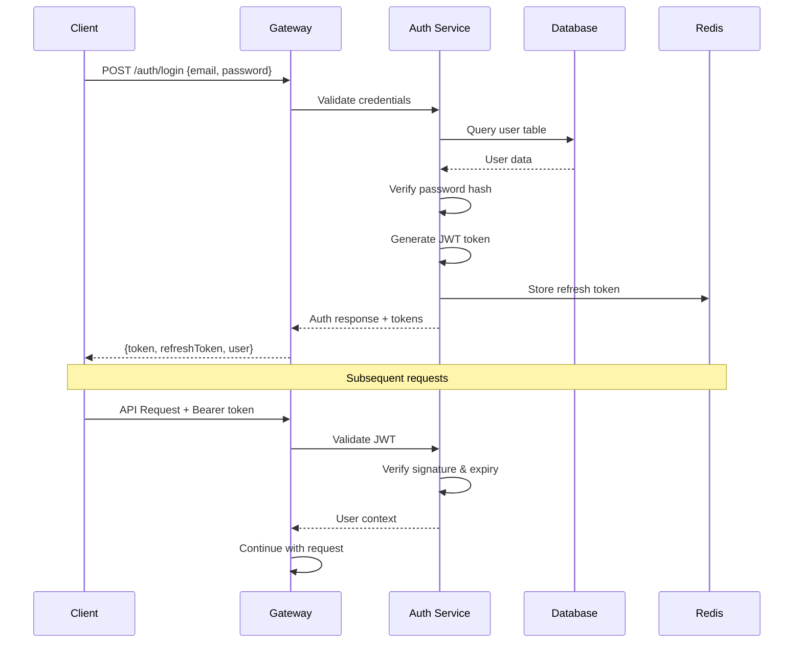
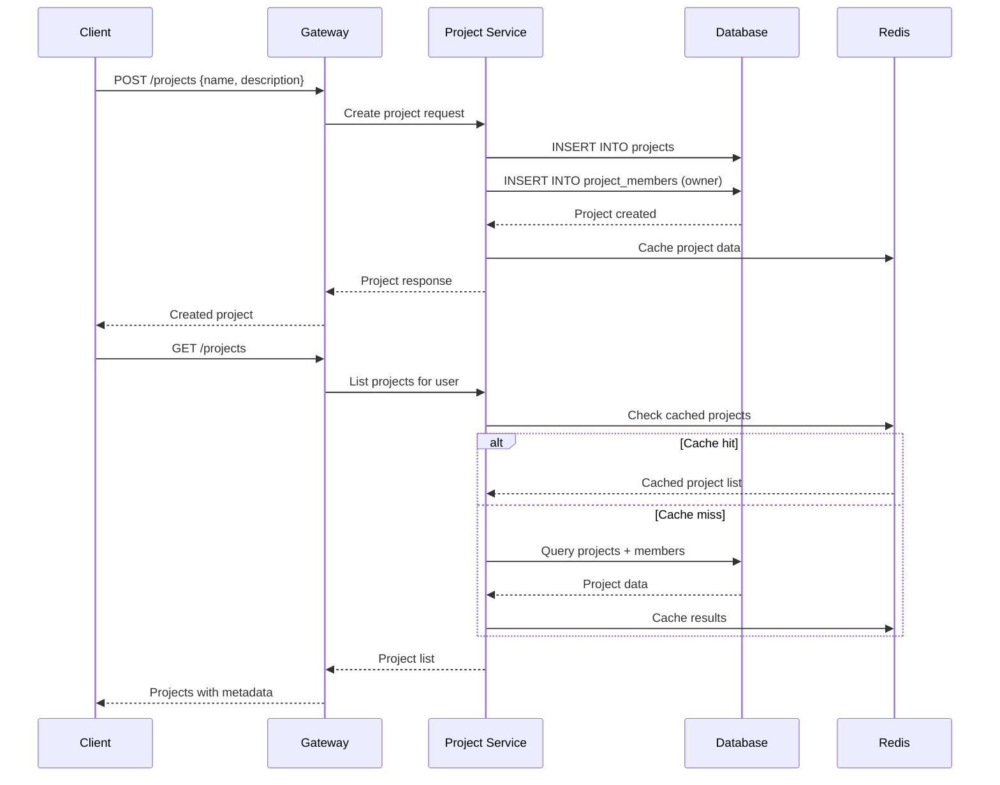
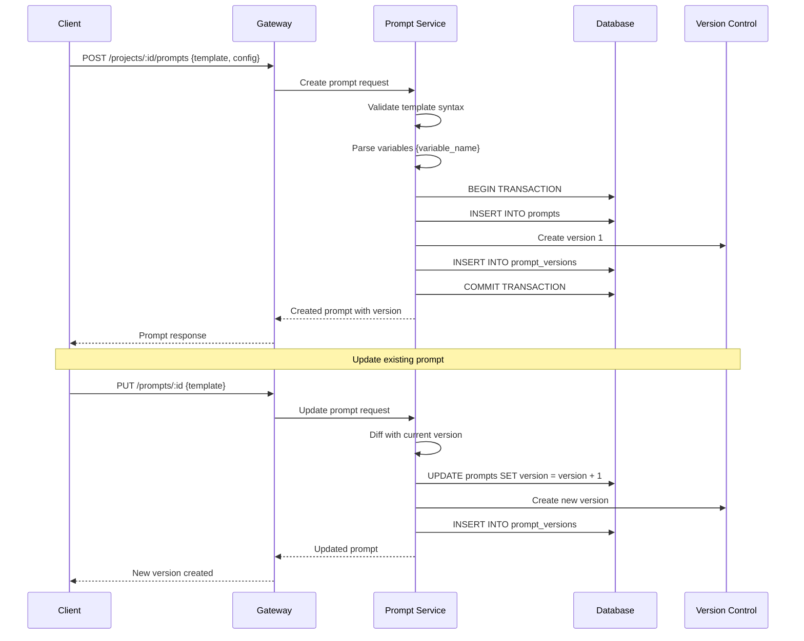
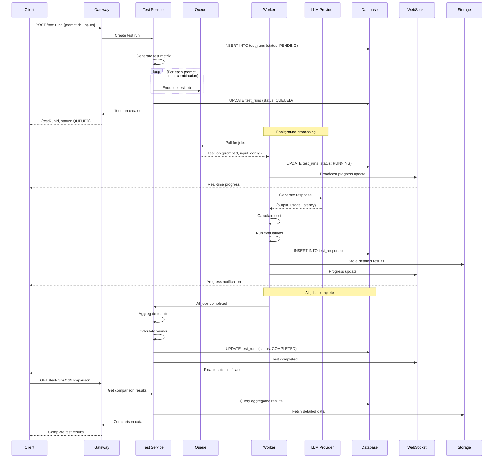
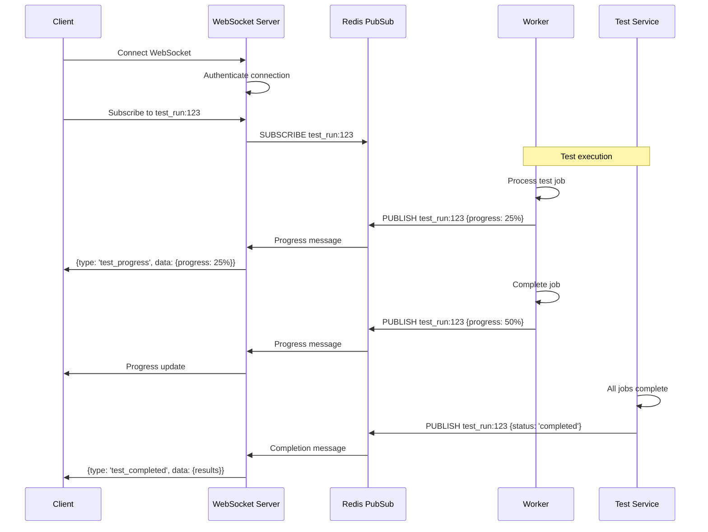
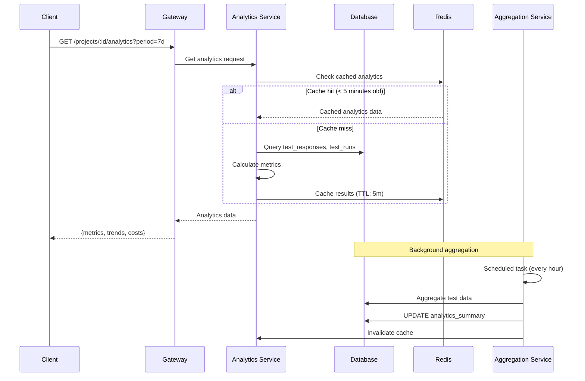
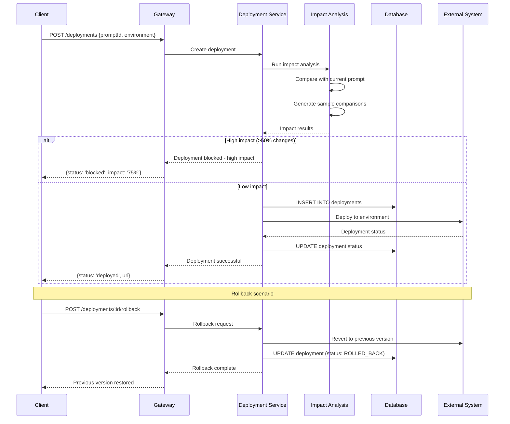

# Prompt Testing Lab - Data Flow Documentation

## Overview

This document describes the data flow patterns, state management, and information architecture of the Prompt Testing Lab system. It covers how data moves through the system, from user interactions to LLM responses and analytics.

## Data Flow Architecture

### High-Level Data Flow



## Detailed Data Flows

### 1. User Authentication Flow



### Data Points:
- **Input**: Email, password
- **Processing**: Password hashing (bcrypt), JWT generation
- **Output**: Access token, refresh token, user profile
- **Storage**: User credentials in PostgreSQL, session data in Redis

### 2. Project Management Flow



### Data Points:
- **Input**: Project name, description, settings
- **Processing**: Permission validation, member assignment
- **Output**: Project with members and statistics
- **Storage**: Project data in PostgreSQL, cached metadata in Redis

### 3. Prompt Creation & Versioning Flow



### Data Points:
- **Input**: Prompt template, model configuration, tags
- **Processing**: Template validation, variable extraction, versioning
- **Output**: Versioned prompt with parsed metadata
- **Storage**: Prompt data and versions in PostgreSQL

### 4. A/B Test Execution Flow

This is the core data flow of the system, handling the execution of prompt comparisons.



### Data Points:
- **Input**: Prompt IDs, test inputs, model configurations, evaluation criteria
- **Processing**: Job orchestration, LLM calls, result aggregation, statistical analysis
- **Output**: Comparative results, winner determination, performance metrics
- **Storage**: Test metadata in PostgreSQL, detailed results in S3, progress in Redis

### 5. Real-time Updates Flow



### Data Points:
- **Input**: WebSocket connection, subscription channels
- **Processing**: Real-time event broadcasting, connection management
- **Output**: Live progress updates, completion notifications
- **Storage**: Connection state in memory, events published via Redis

### 6. Analytics & Cost Tracking Flow



### Data Points:
- **Input**: Time period, project ID, grouping criteria
- **Processing**: Data aggregation, metric calculation, trend analysis
- **Output**: Performance metrics, cost breakdowns, trend data
- **Storage**: Raw data in PostgreSQL, aggregated data in summary tables, cached results in Redis

### 7. Deployment Management Flow



### Data Points:
- **Input**: Prompt ID, target environment, deployment configuration
- **Processing**: Impact analysis, deployment orchestration, rollback management
- **Output**: Deployment status, impact assessment, deployment URLs
- **Storage**: Deployment history in PostgreSQL, configuration in external systems

## Data Storage Patterns

### 1. PostgreSQL Data Organization

```sql
-- Core Entities with Relationships
Users (id, email, name, role, settings)
  ↳ Projects (owner_id → users.id)
    ↳ Project_Members (project_id, user_id, role)
    ↳ Prompts (project_id → projects.id)
      ↳ Prompt_Versions (prompt_id → prompts.id)
      ↳ Test_Runs (project_id → projects.id)
        ↳ Test_Responses (test_run_id → test_runs.id, prompt_id → prompts.id)
        ↳ Test_Metrics (test_run_id → test_runs.id)
    ↳ Deployments (project_id → projects.id, prompt_id → prompts.id)
      ↳ Deployment_History (deployment_id → deployments.id)

-- Indexes for Performance
CREATE INDEX idx_test_responses_test_run_id ON test_responses(test_run_id);
CREATE INDEX idx_test_responses_created_at ON test_responses(created_at);
CREATE INDEX idx_prompts_project_id ON prompts(project_id);
CREATE INDEX idx_project_members_user_id ON project_members(user_id);
```

### 2. Redis Cache Strategy

```javascript
// Cache Key Patterns
{
  // User sessions
  "session:{userId}": {
    ttl: 86400, // 24 hours
    data: { token, refreshToken, lastActivity }
  },
  
  // Project data
  "project:{projectId}": {
    ttl: 3600, // 1 hour
    data: { project, members, stats }
  },
  
  // Test progress
  "test:progress:{testRunId}": {
    ttl: 300, // 5 minutes
    data: { completed, total, currentPrompt }
  },
  
  // Analytics cache
  "analytics:{projectId}:{period}": {
    ttl: 300, // 5 minutes
    data: { metrics, trends, costs }
  },
  
  // Rate limiting
  "ratelimit:{userId}": {
    ttl: 3600, // 1 hour
    data: { requests, windowStart }
  }
}
```

### 3. Object Storage Organization

```
s3://prompt-lab-results/
├── test-runs/
│   ├── {testRunId}/
│   │   ├── config.json
│   │   ├── responses/
│   │   │   ├── {promptId}-{index}.json
│   │   │   └── aggregated.json
│   │   └── comparison/
│   │       └── results.json
├── deployments/
│   ├── {deploymentId}/
│   │   ├── impact-analysis.json
│   │   └── rollback-data.json
└── exports/
    ├── analytics/
    │   └── {projectId}-{timestamp}.csv
    └── test-results/
        └── {testRunId}-export.json
```

## State Management Patterns

### 1. Client-Side State (React)

```typescript
// Global State Structure
interface AppState {
  auth: {
    user: User | null;
    token: string | null;
    isAuthenticated: boolean;
  };
  
  projects: {
    current: Project | null;
    list: Project[];
    loading: boolean;
  };
  
  testRuns: {
    active: TestRun[];
    progress: Record<string, TestProgress>;
    results: Record<string, TestResults>;
  };
  
  ui: {
    theme: 'light' | 'dark';
    sidebarOpen: boolean;
    notifications: Notification[];
  };
}

// State Updates via TanStack Query
const { data: projects } = useQuery({
  queryKey: ['projects'],
  queryFn: () => api.projects.list(),
  staleTime: 5 * 60 * 1000 // 5 minutes
});

// Real-time updates via WebSocket
useEffect(() => {
  const ws = new WebSocket('/ws');
  ws.onmessage = (event) => {
    const update = JSON.parse(event.data);
    if (update.type === 'test_progress') {
      queryClient.setQueryData(
        ['testRun', update.testRunId],
        (old) => ({ ...old, progress: update.data })
      );
    }
  };
}, []);
```

### 2. Server-Side State Management

```typescript
// Service Layer State
class TestExecutionService {
  private activeTests = new Map<string, TestRun>();
  private progressTrackers = new Map<string, TestProgress>();
  
  async createTestRun(config: TestRunConfig): Promise<TestRun> {
    const testRun = await this.db.testRuns.create(config);
    this.activeTests.set(testRun.id, testRun);
    
    // Enqueue jobs
    for (const job of this.generateJobs(testRun)) {
      await this.queue.add('test-execution', job);
    }
    
    return testRun;
  }
  
  async updateProgress(testRunId: string, progress: TestProgress) {
    this.progressTrackers.set(testRunId, progress);
    
    // Broadcast via WebSocket
    await this.websocket.broadcast(`test_run:${testRunId}`, {
      type: 'test_progress',
      data: progress
    });
    
    // Cache in Redis
    await this.redis.setex(
      `test:progress:${testRunId}`,
      300,
      JSON.stringify(progress)
    );
  }
}
```

## Data Consistency Patterns

### 1. ACID Transactions

```sql
-- Test Run Creation with Atomic Job Scheduling
BEGIN;
  INSERT INTO test_runs (id, project_id, config, status) 
  VALUES ($1, $2, $3, 'PENDING');
  
  INSERT INTO test_jobs (test_run_id, prompt_id, input, config)
  SELECT $1, prompt_id, input, config
  FROM generate_test_matrix($2, $3);
  
  UPDATE test_runs SET status = 'QUEUED', job_count = (
    SELECT COUNT(*) FROM test_jobs WHERE test_run_id = $1
  ) WHERE id = $1;
COMMIT;
```

### 2. Eventually Consistent Caching

```typescript
// Cache invalidation strategy
class CacheManager {
  async invalidatePattern(pattern: string) {
    const keys = await this.redis.keys(pattern);
    if (keys.length > 0) {
      await this.redis.del(...keys);
    }
  }
  
  async updateProject(projectId: string, data: ProjectUpdate) {
    // Update database
    const project = await this.db.projects.update(projectId, data);
    
    // Invalidate related caches
    await this.invalidatePattern(`project:${projectId}:*`);
    await this.invalidatePattern(`analytics:${projectId}:*`);
    
    // Update cache with fresh data
    await this.redis.setex(
      `project:${projectId}`,
      3600,
      JSON.stringify(project)
    );
    
    return project;
  }
}
```

### 3. Event Sourcing for Audit Trail

```typescript
// Event-driven state changes
interface DomainEvent {
  id: string;
  type: string;
  aggregateId: string;
  data: any;
  timestamp: Date;
  userId: string;
}

class EventStore {
  async append(event: DomainEvent) {
    await this.db.events.create(event);
    await this.publishEvent(event);
  }
  
  private async publishEvent(event: DomainEvent) {
    // Update read models
    await this.updateProjections(event);
    
    // Broadcast to subscribers
    await this.pubsub.publish(event.type, event);
  }
}

// Example: Prompt deployment events
const events = [
  { type: 'PromptDeploymentRequested', data: { promptId, environment } },
  { type: 'ImpactAnalysisCompleted', data: { impactPercentage: 15 } },
  { type: 'DeploymentApproved', data: { approvedBy: userId } },
  { type: 'PromptDeployed', data: { deploymentUrl, timestamp } }
];
```

## Performance Optimization Patterns

### 1. Query Optimization

```sql
-- Efficient test results aggregation
WITH test_metrics AS (
  SELECT 
    tr.test_run_id,
    tr.prompt_id,
    COUNT(*) as response_count,
    AVG(tr.latency_ms) as avg_latency,
    SUM(tr.cost) as total_cost,
    AVG(tr.evaluation_scores->>'relevance') as avg_relevance
  FROM test_responses tr
  WHERE tr.test_run_id = $1
  GROUP BY tr.test_run_id, tr.prompt_id
)
SELECT 
  p.name as prompt_name,
  tm.*,
  RANK() OVER (ORDER BY tm.avg_relevance DESC) as rank
FROM test_metrics tm
JOIN prompts p ON p.id = tm.prompt_id;
```

### 2. Connection Pooling

```typescript
// Database connection management
const pool = new Pool({
  host: process.env.DB_HOST,
  port: parseInt(process.env.DB_PORT),
  database: process.env.DB_NAME,
  user: process.env.DB_USER,
  password: process.env.DB_PASSWORD,
  min: 2,
  max: 10,
  idleTimeoutMillis: 30000,
  connectionTimeoutMillis: 2000,
});

// Query with automatic connection management
async query(text: string, params: any[]) {
  const client = await pool.connect();
  try {
    const result = await client.query(text, params);
    return result;
  } finally {
    client.release();
  }
}
```

### 3. Batch Processing

```typescript
// Batch LLM requests for efficiency
class LLMBatchProcessor {
  private batch: TestJob[] = [];
  private batchTimeout: NodeJS.Timeout;
  
  async addJob(job: TestJob) {
    this.batch.push(job);
    
    if (this.batch.length >= 10) {
      await this.processBatch();
    } else {
      this.scheduleBatchProcess();
    }
  }
  
  private async processBatch() {
    if (this.batch.length === 0) return;
    
    const jobs = this.batch.splice(0);
    const promises = jobs.map(job => this.processJob(job));
    
    await Promise.allSettled(promises);
  }
  
  private scheduleBatchProcess() {
    clearTimeout(this.batchTimeout);
    this.batchTimeout = setTimeout(() => {
      this.processBatch();
    }, 1000);
  }
}
```

## Data Validation & Security

### 1. Input Validation

```typescript
// Request validation schemas
const createTestRunSchema = z.object({
  promptIds: z.array(z.string().uuid()).min(2).max(10),
  testInputs: z.array(z.string().min(1)).min(1).max(1000),
  evaluationCriteria: z.array(z.enum(['relevance', 'accuracy', 'tone'])),
  modelConfigs: z.record(z.object({
    provider: z.enum(['openai', 'anthropic', 'groq']),
    modelName: z.string(),
    temperature: z.number().min(0).max(2).optional()
  })).optional()
});

// Usage in API handlers
app.post('/test-runs', async (req, res) => {
  try {
    const data = createTestRunSchema.parse(req.body);
    const testRun = await testService.create(data);
    res.json({ success: true, data: testRun });
  } catch (error) {
    if (error instanceof z.ZodError) {
      res.status(400).json({ 
        success: false, 
        error: 'VALIDATION_ERROR',
        details: error.errors 
      });
    }
  }
});
```

### 2. Data Sanitization

```typescript
// Sanitize user inputs
class DataSanitizer {
  static sanitizePromptTemplate(template: string): string {
    // Remove potentially dangerous patterns
    return template
      .replace(/<script\b[^<]*(?:(?!<\/script>)<[^<]*)*<\/script>/gi, '')
      .replace(/javascript:/gi, '')
      .replace(/on\w+\s*=/gi, '')
      .trim();
  }
  
  static sanitizeTestInput(input: string): string {
    // Limit length and remove control characters
    return input
      .substring(0, 10000)
      .replace(/[\x00-\x1F\x7F]/g, '')
      .trim();
  }
}
```

### 3. Access Control

```typescript
// Row-level security implementation
class AccessControl {
  static async checkProjectAccess(
    userId: string, 
    projectId: string, 
    requiredRole: ProjectRole = 'VIEWER'
  ): Promise<boolean> {
    const membership = await db.projectMembers.findUnique({
      where: {
        projectId_userId: { projectId, userId }
      }
    });
    
    if (!membership) return false;
    
    const roleHierarchy = ['VIEWER', 'MEMBER', 'ADMIN', 'OWNER'];
    const userRoleIndex = roleHierarchy.indexOf(membership.role);
    const requiredRoleIndex = roleHierarchy.indexOf(requiredRole);
    
    return userRoleIndex >= requiredRoleIndex;
  }
}

// Usage in services
async getProject(projectId: string, userId: string) {
  const hasAccess = await AccessControl.checkProjectAccess(userId, projectId);
  if (!hasAccess) {
    throw new ForbiddenError('Insufficient permissions');
  }
  
  return this.db.projects.findUnique({ where: { id: projectId } });
}
```

This comprehensive data flow documentation provides a complete picture of how information moves through the Prompt Testing Lab system, from user interactions to data storage and real-time updates. The patterns and examples shown ensure data consistency, performance, and security throughout the application.